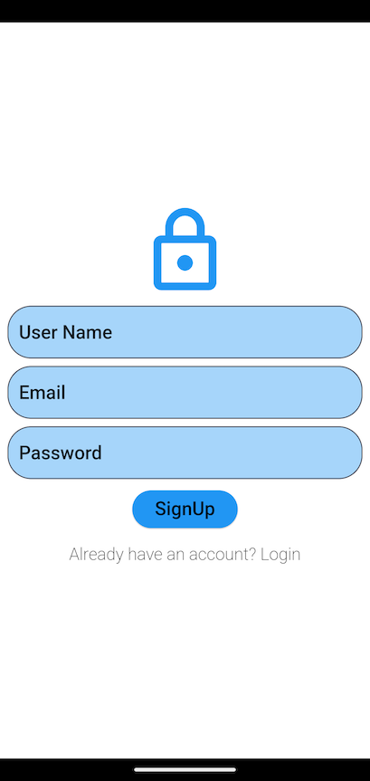
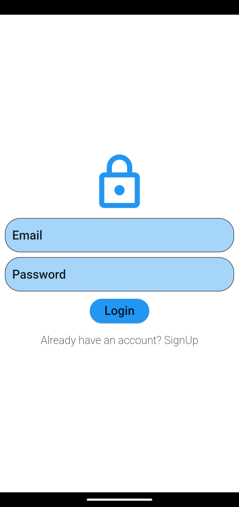
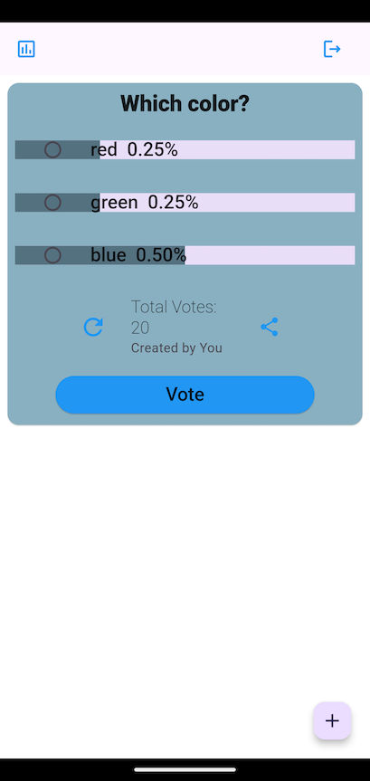
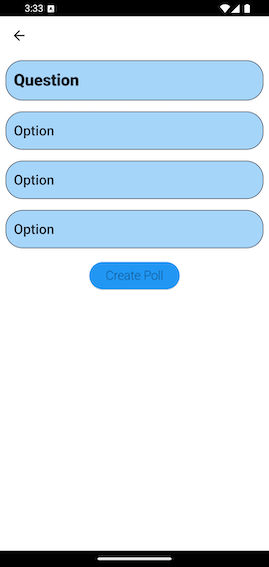

# Poll System App

The **Poll System App** is a Flutter-based polling system that allows users to create, vote, and view polls. It integrates with Firebase services for authentication and database management, ensuring seamless interaction with the backend. This project demonstrates the use of `FirebaseAuth`, `Firestore`, deep linking, and QR code generation within a Flutter app.






## Table of Contents

1. [Features](#features)
2. [Technologies](#technologies)
3. [Installation](#installation)
4. [Usage](#usage)
   - [Creating Polls](#creating-polls)
   - [Fetching Polls](#fetching-polls)
   - [Submitting Responses](#submitting-responses)
   - [Deep Linking](#deep-linking)
   - [QR Code Sharing](#qr-code-sharing)
   - [User Authentication](#user-authentication)
5. [File Structure](#file-structure)

---

## Features

- **User Authentication:** Secure login and signup using Firebase Authentication.
- **Poll Creation:** Authenticated users can create polls with multiple options.
- **Voting:** Users can vote on existing polls.
- **Results Display:** Real-time updates on poll results.
- **Deep Linking:** Supports deep linking for sharing polls.
- **QR Code Sharing:** Users can share poll links through QR codes.
- **Poll Management:** Retrieve and display all available polls.

## Technologies

- **Flutter** (Frontend)
- **Firebase Firestore** (Backend Database)
- **Firebase Authentication** (User Authentication)
- **Provider** (State Management)
- **Deep Linking** (App Links)
- **QR Code Generation** (QR Flutter package)

## Installation

### Prerequisites

- Flutter installed on your local machine.
- Firebase project set up for Firestore and Authentication.
- Android Studio, Xcode, or VSCode for development.

### Steps

1. Clone this repository:

    ```bash
    git clone https://github.com/your-username/poll-system-app.git
    ```

2. Navigate to the project directory:

    ```bash
    cd poll-system-app
    ```

3. Install dependencies:

    ```bash
    flutter pub get
    ```

4. Configure Firebase:

   - Create a Firebase project.
   - Enable Firestore and Authentication in Firebase.
   - Download `google-services.json` (for Android) and `GoogleService-Info.plist` (for iOS) and place them in the respective folders (`android/app` and `ios/Runner`).

5. Run the app:

    ```bash
    flutter run
    ```
    
## Usage

### Creating Polls

The app allows authenticated users to create polls with a set of options.

```dart
Future<bool> createPoll(String question, List<String> options);
```

### Fetching Polls

You can get a list of all polls.

```dart
Future<List<PollModel>> getAllPolls();
```

### Submitting Responses

Users can submit their responses to a poll, which updates the poll’s responses in Firestore.

```dart
Future<void> submitResponse(String pollId, String option);
```

### Deep Linking

The app uses deep linking to open a specific poll directly via a link. The deep linking is handled in the PollProvider class.

```dart
Future<void> _initDeepLinking();
```

### QR Code Sharing

Poll links can be shared via QR codes, allowing users to scan the code and open the poll.

```dart
void showQrCodeDialog(BuildContext context, String link);
```
### User Authentication

The app provides authentication via Firebase, allowing users to log in, sign up, and log out.

#### Login:

```dart
Future<bool> login(String email, String password);
```

#### Signup:

```dart
Future<bool> signup(String email, String password, String displayName);
```

#### Logout:

```dart
Future<void> logout();
```

## File Structure
```bash
├── lib
│   ├── models
│   │   ├── poll_model.dart         # Poll data model
│   │   ├── user_model.dart         # User data model
│   ├── providers
│   │   ├── poll_provider.dart      # Poll-related state management
│   │   ├── user_provider.dart      # User-related state management
│   ├── services
│   │   ├── poll_service.dart       # Firestore operations for polls
│   │   ├── user_service.dart       # Firebase Authentication operations
│   ├── views
│   │   ├── create_poll_screen.dart # Firestore operations for polls
│   │   ├── home_screen.dart        # Firestore operations for polls
│   │   ├── login_screen.dart       # Firebase Authentication operations
│   │   ├── signup_screen.dart      # Firebase Authentication operations
│   ├── app_routes.dart             # App navigation routes
│   └── main.dart                   # App entry point
└── pubspec.yaml
```
