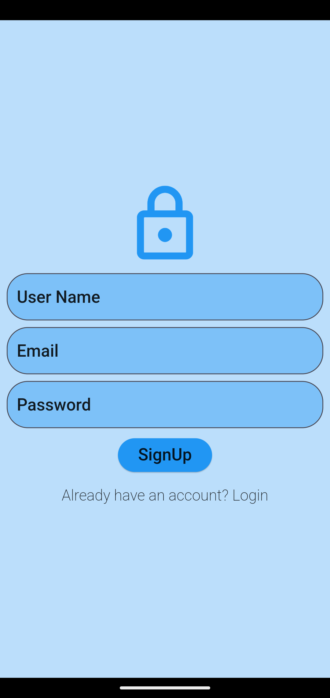
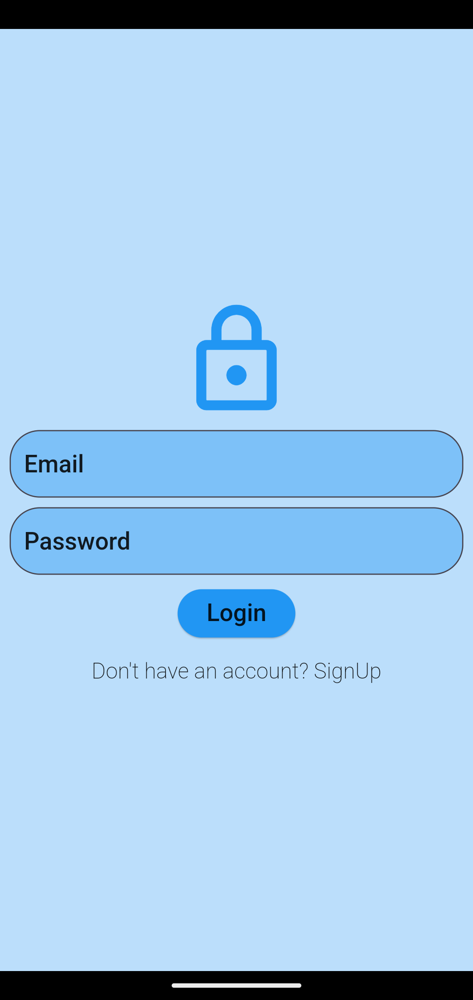
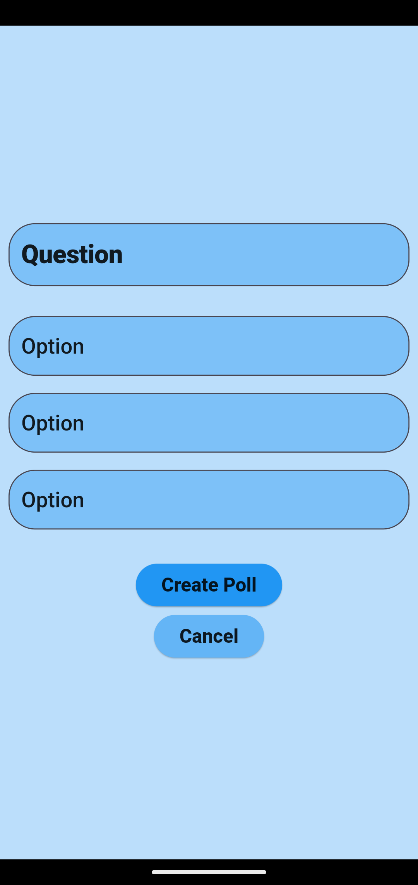

# Poll System App

The **Poll System App** is a Flutter-based polling system that allows users to create, vote, and view polls. It integrates with Firebase services for authentication and database management, ensuring seamless interaction with the backend. This project demonstrates the use of `FirebaseAuth`, `Firestore`, deep linking, and QR code generation within a Flutter app.


<br><br>



## Table of Contents

1. [Features](#features)
2. [Technologies](#technologies)
3. [Usage](#usage)
   - [Creating Polls](#creating-polls)
   - [Fetching Polls](#fetching-polls)
   - [Submitting Responses](#submitting-responses)
   - [Deep Linking](#deep-linking)
   - [QR Code Sharing](#qr-code-sharing)
   - [User Authentication](#user-authentication)
4. [File Structure](#file-structure)

---

## Features

- **User Authentication:** Secure login and signup using Firebase Authentication.
- **Poll Creation:** Authenticated users can create polls with multiple options.
- **Voting:** Users can vote on existing polls.
- **Results Display:** Real-time updates on poll results.
- **Deep Linking:** Supports deep linking for sharing polls.
- **QR Code Sharing:** Users can share poll links through QR codes.
- **Poll Management:** Retrieve and display all available polls.

## Technologies

- **Flutter** (Frontend)
- **Firebase Firestore** (Backend Database)
- **Firebase Authentication** (User Authentication)
- **Provider** (State Management)
- **Deep Linking** (App Links)
- **QR Code Generation** (QR Flutter package)
    
## Usage

### Creating Polls

The app allows authenticated users to create polls with a set of options.

```dart
Future<bool> createPoll(PollModel poll);
```

### Fetching Polls

You can get a list of all polls.

```dart
Future<List<PollModel>> getAllPolls();
```

### Submitting Responses

Users can submit their responses to a poll, which updates the poll’s responses in Firestore.

```dart
Future<void> submitResponse(String pollId, String option);
```

### Deep Linking

The app uses deep linking to open a specific poll directly via a link. The deep linking is handled in the PollProvider class.

```dart
Future<void> _initDeepLinking();
```

### QR Code Sharing

Poll links can be shared via QR codes, allowing users to scan the code and open the app.

```dart
void showQrCodeDialog(BuildContext context, String link);
```
### User Authentication

The app provides authentication via Firebase, allowing users to log in, sign up, and log out.

#### Login:

```dart
Future<bool> login(String email, String password);
```

#### Signup:

```dart
Future<bool> signup(String email, String password, String displayName);
```

#### Logout:

```dart
Future<void> logout();
```

## File Structure
```bash
├── lib
│   ├── models
│   │   ├── poll_model.dart         
│   │   ├── user_model.dart        
│   ├── providers
│   │   ├── poll_provider.dart     
│   │   ├── user_provider.dart     
│   ├── services
│   │   ├── poll_service.dart      
│   │   ├── user_service.dart       
│   ├── views
│   │   ├── create_poll_screen.dart 
│   │   ├── home_screen.dart       
│   │   ├── login_screen.dart      
│   │   ├── signup_screen.dart      
│   ├── app_routes.dart            
│   └── main.dart                   
└── pubspec.yaml
```
